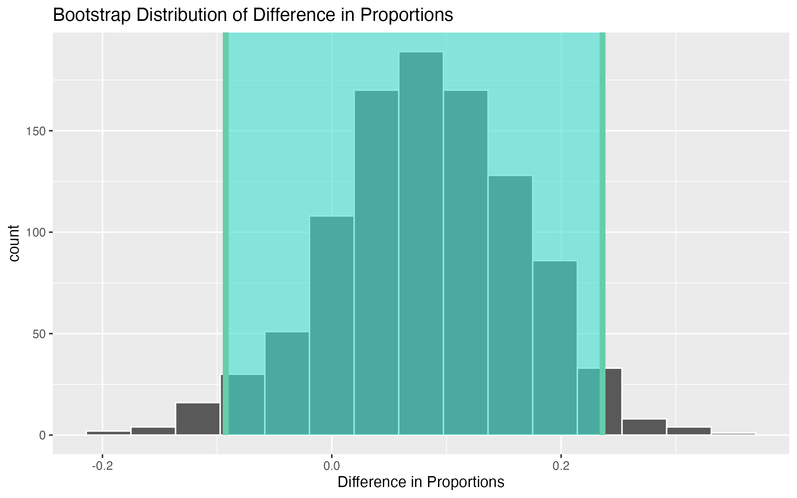
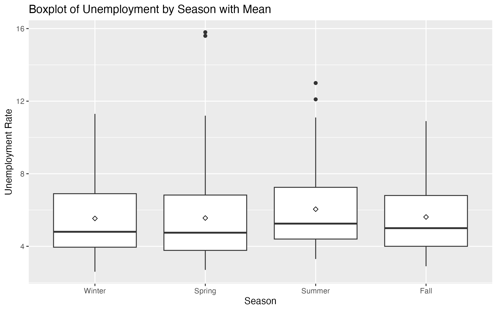
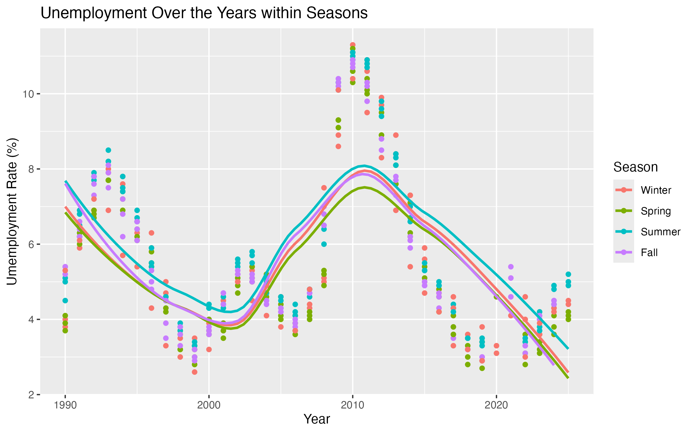

# San Diego Unemployment Analysis: Trends, Seasonality, and COVID-19 Impact

## Overview
This project analyzes long-term unemployment trends in San Diego County using Local Area Unemployment Statistics (LAUS) data from 1990-2024. The goal is to identify structural patterns, evaluate seasonal effects, and measure the impact the COVID-19 pandemic on unemployment levels.

## Key Questions
- Are unemployment rates affected by seasonality?
- How have unemployment trends changed over time?
- Did COVID-19 create a lasting shift in unemployment?

## Dataset
- Source: Local Area Unemployment Statistics (LAUS)
- Region: San Diego County
- Time Period: 1990-2024

## Tools & Methods
- R
- Data cleaning and exploratory data analysis (EDA)
- ANOVA for seasonal analysis
- Bootstrap resampling for statistical inference
- Linear regression modeling

## Key Findings
- No statistically significant seasonal effect was found, suggesting unemployment patterns are relatively stable across months
- COVID-19 caused a sharp structural break, increasing average unemployment by ~1% and producing outliers (peak: 15.8%)
- Long-term trend shows time is a significant predictor, but simple linear models fail to capture nonlinear fluctuations
- Outlier analysis highlights the impact of economic shocks, emphasizing the need for robust modeling approaches

## Visualizations
### Distribution of Unemployment Rate

### Unemployment by Season

### Unemployment Trend Over Time

## Business / Policy Implications
- Short-term economic shocks (e.g., pandemics) can dramatically impact unemployment but may not permanently alter long-term trends
- Policymakers should focus on resilience strategies rather than seasonal interventions
- Traditional linear forecasting models may be insufficient during periods of economic instability

## Notes
This project was originally completed as part of a group assignment and has been reorganized for portfolio presentation. 
